

# ARTICLE OPEN

## 检查更新

# 条件蛋白扩散模型生成具有增强活性的人工可编程核酸内切酶序列

周秉欣$^{1,2,9}$，郑丽蓉$^{1,8,9}$，吴邦豪$^{1,3,9}$，易凯$^{4}$，钟博子韬$^{1}$，谭阳$^{1}$，刘倩$^{3}$，Pietro Liò$^{5}$，洪亮$^{1,2,6,7}$

© 作者 2024

基于深度学习的功能蛋白生成方法正满足着对新型生物催化剂日益增长的需求，使得能够精确定制功能以满足特定要求。这一进展推动了高效且特化的蛋白质的开发，这些蛋白质在科学、技术和生物医学领域具有多种应用。本研究建立了一个基于条件蛋白扩散模型（即CPDiffusion）的蛋白质序列生成流程，用于创建具有增强功能的多样化蛋白质序列。CPDiffusion 能够适应蛋白质特异性条件，例如二级结构和高度保守的氨基酸。在不依赖大量训练数据的情况下，CPDiffusion 有效地捕获了特定蛋白质家族的高度保守残基和序列特征。我们应用 CPDiffusion，基于野生型（WT）Kurthia massiliensis Ago（KmAgo）和 Pyrococcus furiosus Ago（PfAgo）的骨架结构生成了 Argonaute（Ago）蛋白的人工序列，这两种蛋白均为复杂的多结构域可编程核酸内切酶。生成的序列与野生型模板的差异多达近 400 个氨基酸。实验测试表明，对于 KmAgo 和 PfAgo，生成的大多数蛋白在 DNA 切割中均表现出明确的活性，且其中许多蛋白显示出优于野生型的活性。这些发现强调了 CPDiffusion 在单步生成具有复杂结构和功能的新型蛋白序列方面具有显著的成功率，从而实现了活性的增强。该方法通过**计算机生成和筛选**，无需标注数据的监督，即可促进具有多结构域分子结构和复杂功能的酶的设计。

Cell Discovery; https://doi.org/10.1038/s41421-024-00728-2

## 引言

深度学习辅助的功能蛋白设计代表了一种创新且有前景的方法，能够加速并改进新型蛋白质的创建$^{1,2}$。通过利用深度学习的力量，研究人员能够生成具有根据特定标准量身定制功能的新型蛋白质$^{3-5}$。将深度学习整合到新型蛋白质生成中，为生产具有高度期望特性（如更高的稳定性、更强的结合亲和力和更高的酶活性）的蛋白质提供了机会。深度学习生成和优化多种潜在蛋白质结构的卓越能力，将蛋白质工程和发现的边界推向了新的高度。这种范围的扩展为创造具有独特且有价值功能的蛋白质提供了机会。同时，生成具有特定功能的新型蛋白质序列显著增加了研究人员的选项，使得有可能识别出具有优异活性和稳定性的候选蛋白质。此外，生成的各种新型蛋白质序列库丰富了所研究蛋白质家族的文库，超越了有限天然序列的局限。这种扩展不仅补充了可用于分析和理解蛋白质的资源，而且为旨在增强功能的工程化提供了更大的蛋白质模板组。目前，已有几种突出的深度学习模型被应用于设计具有所需功能的新型蛋白质序列$^{6-9}$。一个问题是现有模型参数庞大，需要大量高质量的真实世界数据进行训练和微调，以及大量的计算资源进行部署和推理。同时，需要额外的努力对这些模型设计的蛋白质进行实验，以发现一小组在缓冲液中可溶或展现出足够生物活性的生成蛋白。值得注意的是，这些研究中测试的蛋白质往往针对相对简单的蛋白质。

---

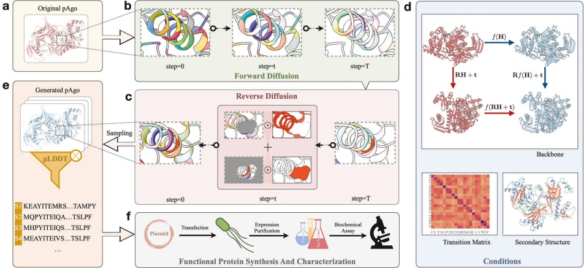

图 1 采用CPDiffusion设计新型中温pAgo序列的工作流程。箭头展示了各组件间的信息流。**a** 对野生型pAgo进行处理，提取具有分子生化和拓扑特性的氨基酸级图表示（详见补充数据第1节）。**b** 在前向扩散过程中，pAgo蛋白中的每种氨基酸类型按某种转移概率矩阵在T步内被逐步扰动，最终达到均匀分布（详见补充数据第2.1节）。**c** 反向扩散过程从每个氨基酸位点在20种类型上以均匀分布随机采样开始，随后进行逐步去噪。**d** 去噪过程受条件引导，包括来自野生型pAgo的主链模板和二级结构，以及转移矩阵（详见补充数据第2.2节）。特别地，传播函数 $ f(\cdot) $ 通过等变图卷积层拟合，该层在任意旋转R和平移t下保证SE(3)等变性。**e** 从去噪步骤0时刻学习到的分布中采样一组蛋白质序列，随后根据AlphaFold2 $ ^{39} $ 预测的pLDDT进行筛选。**f** 候选序列通过湿实验合成、表征和评估进行确认。

由于这些蛋白质结构简单、功能单一，且难以推广至更广泛的蛋白质或蛋白质家族，现有模型面临诸多障碍。这些共同挑战凸显了建立新深度学习模型来设计具有多域结构和复杂功能的全新蛋白质序列的复杂性。

作为一种从复杂分布 $ ^{10-14} $ 中生成多样化样本的新兴工具，去噪扩散概率模型（DDPM）因其自然且强大的特性，成为生成全新蛋白质序列的有力候选。在当前任务中，识别具有目标结构或功能但序列差异显著的蛋白质具有重要意义。DDPM的设计理念满足了这一需求，它通过组装可训练的神经网络层，逐步去噪定义噪声分布的人工扰动，从而揭示原始数据分布 $ ^{9,15-19} $。通过与特定目标对齐的迭代去噪步骤，DDPM揭示了连接蛋白质序列与结构及其功能的隐式映射规则。此外，去噪过程可以以目标蛋白质的特定结构偏好或其他特征为条件，引导输出采样分布朝向有利方向。因此，经过训练的DDPM具备根据一组为目标功能量身定制的期望属性，生成多样化蛋白质序列的卓越能力。

本研究应用DDPM方法生成名为原核Argonaute（pAgo）蛋白的可编程核酸内切酶的全新序列。pAgo蛋白是一类在原核生物DNA干扰中起关键作用的核酸内切酶，在生物技术和生物工程领域引起了广泛关注 $ ^{20-25} $。它们靶向并切割特定单链DNA/RNA序列的卓越能力在诊断领域产生了重要应用，使得设计用于检测和定量与病原体或癌症相关突变相关的核酸序列的分子诊断检测方法成为可能 $ ^{21,23} $。这些检测方法有望改善疾病的早期检测和精准治疗。此外，pAgo蛋白对底物具有高亲和力并能特异性识别靶序列，使其成为成像 $ ^{26-28} $ 和基因编辑 $ ^{29} $ 的重要工具。中温pAgo蛋白被认为有望整合到等温核酸检测和基因编辑技术中 $ ^{25,30,31} $。然而，其潜在应用受限于较低的DNA切割活性。因此，需要开发策略来增强pAgo蛋白在环境条件下的酶功能。在此背景下，我们引入一种功能导向的设计方案，使用**条件蛋白质扩散模型（CPDiffusion）** 进行序列生成。CPDiffusion通过从一组多样化的数据（包括所有具有实验解析结构的不同类型蛋白质以及约700个野生型pAgo蛋白的小数据集）中学习隐式促进规则，识别有效的人工pAgo序列空间。我们基于Kurthia massiliensis Ago（KmAgo）和Pyrococcus furiosus Ago（PfAgo） $ ^{32,33} $ 的主链生成了两组长Ago蛋白。KmAgo是一种中温pAgo蛋白，能以DNA和RNA为向导切割DNA和RNA；而PfAgo是一种超嗜热pAgo蛋白，仅以DNA为向导切割DNA，且自然界中仅在高温下发挥作用。两者均具有六个结构域，长度近800个氨基酸。经过高效的训练和筛选流程（图 1），CPDiffusion获得了27个新型人工KmAgo（Km-APs）和15个Pf-APs。与模板野生型蛋白相比，其序列一致性相似度为50%–70%。除模板外，APs与NCBI中其他野生型蛋白的序列一致性低于40%。与经典理性设计方法不同，模型训练和推理的整个过程只需极少的专家指导。然而，在针对特定蛋白优化时，CPDiffusion能自动识别高度保守区域，同时让其余区域保持高度变异。

---

我们通过生物物理和生化实验验证了CPDiffusion设计的pAgo蛋白的酶学功能和热稳定性。蛋白表达与纯化实验表明，所有27个Km-AP均成功表达且具有可溶性。值得注意的是，24个Km-AP表现出单链DNA（ssDNA）切割活性，其中20个序列的ssDNA切割活性优于野生型KmAgo。同时，全部15个Pf-AP在缓冲液中成功表达且可溶，在45 °C下展现出明确的ssDNA切割活性，其熔解温度从100 °C变化至50 °C。在这15个Pf-AP中，6个Pf-AP（在45 °C下）的活性甚至高于95 °C下的野生型PfAgo，其中最优Pf-AP的酶活达到后者的两倍。通过CPDiffusion生成的新型可编程核酸内切酶在常温条件下活性大幅提升，对于基因编辑和分子诊断中易于实施的高通量筛选方法具有重要实用价值 $^{25,31,34}$。此外，CPDiffusion在生成大型复杂蛋白（如酶学功能增强的pAgo蛋白）的新序列方面具有高成功率，这代表了蛋白质设计与工程在生物医学、生物技术和环境应用领域的重大进展。

## 结果

CPDiffusion基于天然蛋白质结构训练了一个具有400万可学习参数的去噪扩散模型。该模型为氨基酸（AA）分配类别噪声分布，并通过条件反向扩散学习其分布。CPDiffusion的整体构建见材料与方法部分及补充数据第2、3节。为进行基线比较，我们使用来自CATH 4.2的约20,000个晶体结构训练了一个基础模型 $^{35,36}$，以学习蛋白质结构构象中的序列模式。我们通过在CATH 4.2、TS50和T500等多个开放测试基准上的反向折叠任务验证了基础模型的生成性能。在生成新型pAgo序列的应用中，我们在CATH 4.2中野生型蛋白所蕴含的一般蛋白构建规则之上，训练CPDiffusion学习Ago蛋白的保守模式。我们特意纳入了一组来自pAgo家族的693个野生型蛋白，使模型偏向于理解pAgo蛋白 $^{37}$；用于生成的模板蛋白已从总共694个pAgo数据集中排除。额外pAgo家族蛋白的训练增强了模型生成具有期望氨基酸组成模式序列的能力（补充数据第5节）。

与现有基线方法相比，CPDiffusion生成的序列可靠性更高、恢复率更高且序列多样性更好（补充数据第4节）。附加条件（如二级结构和转移矩阵）进一步提升了CPDiffusion在恢复蛋白质序列分布方面的能力（补充图S3）。特别是在为pAgo蛋白设计序列时，CPDiffusion相比ProteinMPNN等基线方法表现出显著优势。它并非在保留蛋白质生物学上有意义的氨基酸特性（如极性氨基酸）方面全面表现更好。这一特性对于蛋白质稳定性及蛋白质-核酸相互作用至关重要（补充图S4），但ProteinMPNN错误生成了许多电荷相反的极性氨基酸，可能损害生成蛋白的功能。此外，训练后的CPDiffusion成功生成了PIWI结构域中的催化四联体，而ProteinMPNN则未能做到（补充图S5和S6）。准确生成催化四联体对于确保蛋白切割靶标核酸的功能完整性至关重要，若所研究pAgo蛋白设计的四联体中任意氨基酸生成错误，将直接导致其功能失效 $^{38}$。

#### 生成型Ago序列的筛选流程

利用训练好的CPDiffusion，以KmAgo为模板生成了100个pAgo序列，这些序列与模板的序列一致性低于70%。接下来进行基于初始结构的筛选，以减少实验工作量。鉴于pAgo蛋白的结构保守性，我们采用AlphaFold2 $^{39}$通过新序列相对于模板KmAgo的结构预测置信度来评估其质量。首先，比较生成序列的整体预测局部距离差异测试（pLDDT）分数，剔除整体pLDDT分数低于100个样本平均分一个标准差的生成样本（图2a，顶部面板）。随后，通过 $\sigma(\Delta pLDDT)$（图2a，中部面板）和 count($\Delta pLDDT > 10$)（图2a，底部面板）衡量生成样本与野生型KmAgo的残基水平差异，其中 $\Delta pLDDT = pLDDT_{AP} - pLDDT_{WT}$ 描述生成序列与野生型KmAgo序列之间每个残基的pLDDT差值。前者计算AP与野生型之间每残基pLDDT差值的波动性。按照我们的期望，剔除那些与野生型模板不一致性较小的序列（即 $\sigma(\Delta pLDDT)$ 超过平均不一致性一个标准差以上的序列）。最后一个标准剔除那些超过93个氨基酸位置具有 $\Delta pLDDT$ 大于10的序列。同样，阈值93取自平均值以上一个标准差。

上述三个初始筛选标准导致约30个生成序列被排除。随后进行更精细的分析，在残基水平比较生成序列与野生型KmAgo的pLDDT分数。最终，我们选出27个Km-AP（序列列于补充表S5~S13），这些序列在局部结构（由AlphaFold2预测）上与野生型KmAgo高度一致（图2b；补充图S8~S34）。作为对比，被排除的AP的示例pLDDT曲线见补充图S35~S40，这些曲线均表现出一定程度的局部不一致性。此外，选定的Km-AP与野生型KmAgo进行了结构比对，以确认其结构相似性（补充图S42）。还使用均方根偏差（RMSD）和模板建模（TM）分数量化了结构差异（补充图S41），所有27个选定蛋白与野生型KmAgo相比的RMSD值均低于3 Å，处于pAgo蛋白X射线晶体学通常观察到的分辨率范围内 [38,40,41]。同时，所有Km-AP的TM分数均高于0.9，表明生成蛋白与野生型KmAgo具有相同的三维结构。高度结构一致性不仅体现在选定的27个Km-AP中，也存在于所有CPDiffusion生成的序列中。如图2c总结，Km-AP（红色）和CPDiffusion生成的原始序列（黄色）均表现出低RMSD和高TM分数。换言之，筛选程序选择的是最可信的蛋白序列用于测试，而非试图预测并过滤掉无活性的样本。除了高度结构一致性，生成的蛋白序列还表现出高度的序列多样性。如图2c（右侧两个面板）所示，27个Km-AP与野生型KmAgo的序列相似性为50%~70%，与NCBI非冗余（NR）数据库 [42] 中所有野生型蛋白的相似性为30%~40%。此外，这些生成Km-AP之间的成对一致性范围为40%~70%。更详细的统计信息见补充图S44~S47。

PfApo的整体生成与筛选流程相同。基于野生型PfAgo模板，我们从50个生成序列中总共选出15个Pf-AP（见补充数据第6.4节）。与Km-AP类似，这15个Pf-AP也表现出高度的结构构建一致性。所有TM分数均高于0.97，所有RMSD分数均低于1 Å（补充图S83）。这些序列与野生型PfAgo的序列一致性约为60%，并且

---

a

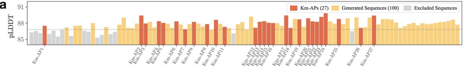

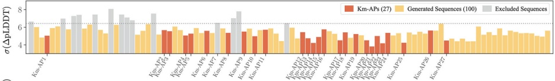

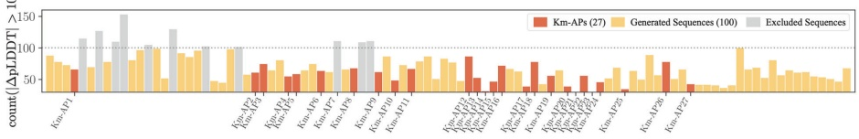

b

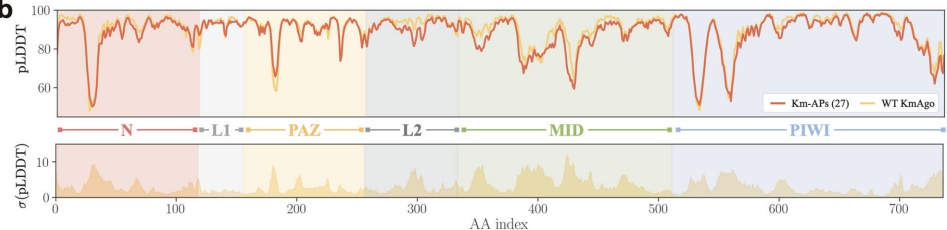

C

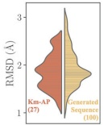

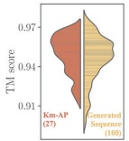

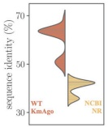

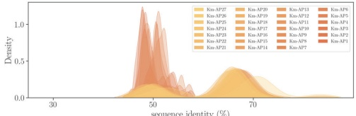

图 2. 通过CPDiffusion生成的人工 KmAgo 蛋白的初始筛选与基于序列的分析。a 对生成的100条序列进行初始筛选的三个步骤（黄色）。每一步中被排除的序列以灰色显示，最终的27个 Km-AP 以红色突出显示。过滤阈值以虚线水平线表示。从上到下的三个子图分别展示了：生成 KmAgo 序列的蛋白水平平均 pLDDT（上方），野生型 KmAgo 与生成 KmAgo 序列之间残基水平差异的平均波动性（中间），以及具有较大残基水平 pLDDT 差异的氨基酸位点计数（下方）。b 野生型 KmAgo 与平均 Km-AP（上方子图，红色）的残基水平 pLDDT 比较。下方子图展示了野生型 KmAgo 与 Km-AP 的 pLDDT 差值标准差。c 生成 KmAgo 序列的结构（左侧两个子图）与序列变异（右侧两个子图）汇总。27个 Km-AP（红色）与100条生成序列（黄色）相对于野生型 KmAgo 的 RMSD 值（第一个子图）和 TM 得分（第二个子图）表明，生成序列与野生型 KmAgo 的 AlphaFold2 预测结构整体一致，但100条生成序列中存在少数离群值。对于27个 Km-AP，它们与野生型 KmAgo 的序列同一性（第三个子图）范围为 50% 至 70%，与 NCBI NR 数据库中所有野生型蛋白的序列同一性（黄色）范围为 30% 至 45%。此外，它们的成对序列同一性（第四个子图）低于 40% 至 80%，其中大部分接近 50%。

与非 PfAgo 蛋白相比约 40%（补充图 S86–S88）。用于实验检测的序列列于补充表 S19–S23。

### 人工蛋白的可溶性、活性及热稳定性实验评估

先前的筛选流程得到了27个 Km-AP，这些蛋白与野生型 KmAgo 结构一致（图 3a, b），并在序列层面具有令人满意的多样性。随后进行湿实验以评估这些 Km-AP 的表达、单链 DNA（ssDNA）切割活性及热稳定性。使用与绿色荧光蛋白（GFP）融合的 polyG 接头评估每个 Km-AP 的蛋白表达。在缓冲液条件下，所有27个 Km-AP 均显示出明显的绿色荧光信号（图 3c），表明成功表达并具有可溶性。我们进行了同步辐射小角 X 射线

---

a

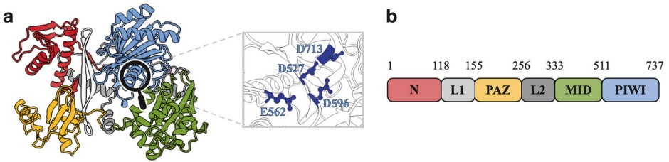

b

C

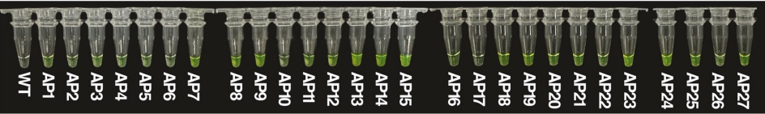

d

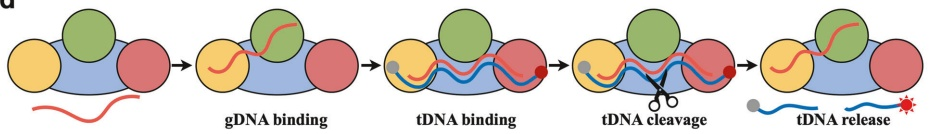

e

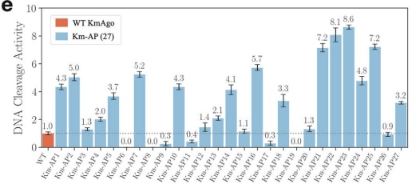

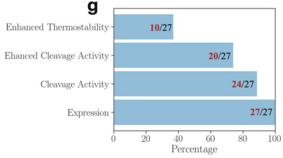

f

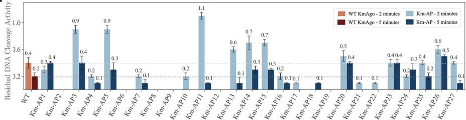

**图 3** **CPDiffusion生成的人工KmAgo的合成与表征** **a** 左图：WT KmAgo（由AlphaFold2预测）的结构域架构示意图。N结构域、Linker1、PAZ结构域、Linker2、MID结构域和PIWI结构域分别以红色、浅灰色、黄色、绿色、灰色和蓝色表示。右图：WT KmAgo的催化位点。 **b** WT KmAgo结构域组织的示意图。 **c** 27种Km-APs表现出可溶性表达，通过将GFP与Km-APs连接可视化。 **d** KmAgo DNA催化循环的示意图。 **e** WT KmAgo与27种Km-APs在37 °C下对ssDNA的切割活性。蛋白质加载ssDNA引导链，然后以2:1:1的摩尔比（蛋白质:引导链:靶标）与ssDNA靶标孵育。这些活性由荧光强度随时间曲线的斜率定义$ ^{44} $。对两次独立实验的结果进行定量，误差棒表示相应的标准差。 **f** WT KmAgo与27种Km-APs在42 °C下孵育2分钟和5分钟后的ssDNA切割活性，显示Km-APs相较于WT KmAgo的热稳定性增强。 **g** 27种测试Km-APs的性能总结：所有蛋白质均可表达，其中24种表现出单链DNA切割活性，20种活性超过WT，10种表现出增强的热稳定性。

---

利用Guinier分析和成对分布函数（P(r)）计算了缓冲液中蛋白质的回转半径（$ R_{g} $）。如补充图S50和表S14所示，两种分析均表明，Km-APs的$ R_{g} $与Km-WT相同，说明Km-APs在缓冲液中以单体形式存在。通过比较圆二色（CD）信号和SAXS与Km-WT的结果，研究了Km-APs的可折叠性，补充图S51和表S14的结果表明其在缓冲液中正确折叠。随后，我们检测了这些Km-APs的ssDNA切割活性。图3d展示了pAgo蛋白的切割过程，其中红色荧光表示对靶标DNA（tDNA）的有效切割。值得注意的是，24种Km-APs在37°C下显示出ssDNA切割活性（图3e；补充图S52和S58），且20种Km-APs的DNA切割活性相较Km-WT有所增强。性能最佳的蛋白（Km-AP23）的ssDNA切割活性几乎是野生型（WT）的9倍。我们进行了额外实验，以进一步测试功能显著增强的Km-APs的切割活性。在这两个实验中，蛋白质:向导:靶标的比例分别设定为5:2:2和3:2:2。补充图S59所示的结果表明，Km-APs在不同蛋白质:向导:靶标比例下均表现出增强的切割活性。这些结果进一步证明，CPDiffusion能够生成功能增强的Km-APs。为了进一步验证Km-AP23功能的增强，我们利用米氏动力学模型对Km-WT、Km-AP23和Km-AP9（功能减弱）的生物功能进行了定量分析。如补充图S60和表S15所示，我们发现与Km-WT相比，Km-AP23的$ K_{M} $值降低，而Km-AP9的$ K_{M} $值升高，表明Km-AP23对底物的亲和力增强，而Km-AP9的亲和力减弱。此外，与Km-WT相比，Km-AP23的$ k_{cat} $值升高，而Km-AP9的$ k_{cat} $值降低，表明Km-AP23的切割效率提升，而Km-AP9的切割效率下降。这些结果进一步证明Km-AP23的活性高于Km-WT。我们还将Km-AP23与其他公认的野生型pAgo蛋白进行了比较（补充图S61），并使用来自不同疾病和病毒的多种向导DNA（gDNA）和靶标DNA（tDNA）序列进行了切割实验（补充图S62）。在不同DNA序列上，Km-AP23始终表现出比其他中温pAgo蛋白更高的切割活性。为了更深入地了解Km-AP23的性能，我们采用电泳迁移率变动分析（EMSA）分析了Km-AP23与gDNA的结合。补充图S53的结果显示，与Km-WT相比，在不同蛋白质浓度下，Km-AP23组中蛋白质-gDNA二元复合物的形成增加。这一观察结果表明，Km-AP23对gDNA的结合能力增强，从而为增强与tDNA的结合提供了更多的模板。我们还采用了荧光偏振实验来研究其对gDNA和tDNA的结合亲和力。补充图S54的结果显示，Km-AP23的解离常数（$ K_{d} $）低于WT KmAgo，表明Km-AP23对gDNA和tDNA的结合亲和力增加。此外，我们测试了Km-AP23的核酸偏好性（补充图S63）。当使用ssDNA作为向导时，Km-AP23对DNA和RNA均表现出增强的切割活性。然而，当使用ssRNA作为向导时，它对DNA和RNA的切割活性相当或降低，表明Km-AP23更倾向于使用ssDNA而非ssRNA作为向导$ ^{32,43} $。我们利用分子动力学（MD）模拟计算了Km-WT和Km-AP23整个结构中gRNA/tDNA的结合自由能（蛋白质-gRNA-tDNA复合物的结构由AlphaFold3预测）。如补充图S64所示，Km-AP23的gRNA/tDNA结合自由能高于Km-WT，这表明Km-AP23可能无法形成稳定的蛋白质-gRNA-tDNA结构来进行切割。此外，我们分析了Km-AP23中突变位点的分布。如补充图S102所示，突变更频繁地位于蛋白质表面。通过在42°C下孵育2分钟和5分钟，然后进行ssDNA切割活性测定，并将结果归一化至其在37°C下的相应活性，从而评估了Km-APs的热稳定性。图3f显示，27种Km-APs中有10种表现出比WT KmAgo更高的热稳定性。特别值得注意的是，某些Km-APs（例如Km-AP5和Km-AP14，图3f）在活性和热稳定性方面均表现出同时增强。

对于Pf-APs，我们选择了15种进行湿实验验证。尽管KmAgo和PfAgo的结构相当保守（图4a，b），序列一致性为25.42%，但这两种蛋白质处于不同的进化分支（图5a），并且具有不同的活性温度和核酸偏好性$ ^{32,33,44} $。SDS-PAGE和SAXS实验表明，所有Pf-APs均可被纯化并在缓冲液中保持单体形式（补充图S90和表S24）。通过比较SAXS与Pf-WT的结果，研究了Pf-APs的整体堆积情况；补充图S91的结果表明其在缓冲液中正确折叠。对这些Pf-APs进行了ssDNA切割实验，值得注意的是，所有15种Pf-APs均显示出ssDNA切割活性（图4c；补充图S93和S94）。为了全面评估其性能，我们以PfAgo在45°C和95°C下的ssDNA切割活性以及KmAgo在45°C下的ssDNA切割活性作为参考。所有Pf-APs在45°C下均表现出比WT PfAgo增强的切割活性。此外，11种Pf-APs在45°C下表现出比WT KmAgo增强的切割活性，而6种Pf-APs（在45°C下）甚至比WT PfAgo在95°C下更为活跃（图4e）。一个值得注意的观察结果是，Pf-APs的熔解温度（~50°C）低于WT PfAgo（~100°C）（图4d），并且Pf-APs在中等温度下的活性有所增强。这些结果可归因于我们的训练数据集主要包含来自中温原核生物的pAgo蛋白（补充图S101）。因此，我们可以得出结论：CPDiffusion生成的Pf-APs保留了模板WT的功能特征，而与其整体氨基酸堆积相关的热稳定性则从训练数据集中继承而来。这一例子可能为未来将超嗜热蛋白改造为在中温条件下工作的应用开辟新途径。

总体而言，在测试的Km-APs和Pf-APs中观察到的增强的生物功能，特别是在DNA切割活性方面，突显了CPDiffusion在以功能为导向的蛋白质设计中的前景广阔的能力。该模型高效地学习、发现和探索来自高质量训练数据集的隐含“序列-结构-功能”关系，该数据集仅包含来自同一家族的少量蛋白质。这种能力使得能够可靠地生成具有所需功能和增强性能的蛋白质序列。

## CPDiffusion生成的新颖序列的生物信息学和计算分析

为了从功能和进化关系的角度理解CPDiffusion生成的序列与WT pAgo蛋白之间的关系，我们对其序列和结构进行了全面分析。首先，我们对Km-APs和Pf-APs进行了进化分析，以确定它们与其他WT pAgo蛋白的关系。通过Km-APs、Pf-APs和pAgo数据库中蛋白质的多序列比对（MSA）构建了系统发育树（图5a和材料与方法部分）。设计的Km-APs和Pf-APs位于long-A分支内，分别属于KmAgo谱系和PfAgo谱系，并与long-A型pAgo共享进化特性。

---

a

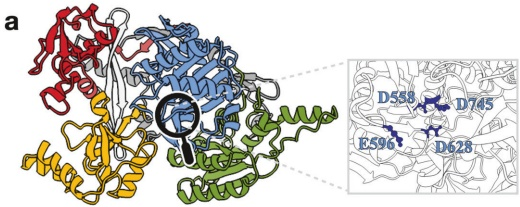

b

<table border=1 style='margin: auto; word-wrap: break-word;'><tr><td style='text-align: center; word-wrap: break-word;'>1</td><td style='text-align: center; word-wrap: break-word;'>109</td><td style='text-align: center; word-wrap: break-word;'>152</td><td style='text-align: center; word-wrap: break-word;'>276</td><td style='text-align: center; word-wrap: break-word;'>362</td><td style='text-align: center; word-wrap: break-word;'>545</td><td style='text-align: center; word-wrap: break-word;'>771</td></tr><tr><td style='text-align: center; word-wrap: break-word;'>N</td><td style='text-align: center; word-wrap: break-word;'>L1</td><td style='text-align: center; word-wrap: break-word;'>PAZ</td><td style='text-align: center; word-wrap: break-word;'>L2</td><td style='text-align: center; word-wrap: break-word;'>MID</td><td style='text-align: center; word-wrap: break-word;'>PIWI</td><td style='text-align: center; word-wrap: break-word;'></td></tr></table>

C

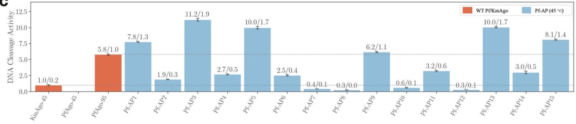

d

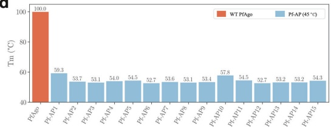

e

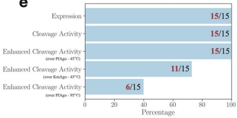

**图4 CPDiffusion生成的人工PfAgo的合成与表征。** a 左图：WT PfAgo（由AlphaFold2预测）的结构域架构示意图。N结构域、Linker1、PAZ结构域、Linker2、MID结构域和PIWI结构域分别以红色、浅灰色、黄色、绿色、灰色和蓝色表示。右图：WT PfAgo的催化位点。b WT PfAgo结构域组织的示意图。c 15种Pf-APs在45 °C下的切割活性。蛋白质与ssDNA引导链按2:1:1摩尔比（蛋白质:引导链:靶标）混合，再与ssDNA靶标孵育。活性通过荧光强度对时间曲线的斜率定义$^{44,52}$。对两次独立实验的结果进行定量，误差棒表示相应的标准差。d WT PfAgo与Pf-APs的熔解温度（Tm）。Pf-APs的Tm通过DSF光谱测定，WT PfAgo的Tm引自文献$^{44}$。e 在测试的15种Pf-APs中，所有蛋白均能表达，表现出ssDNA切割活性，并在45 °C下超越WT PfAgo的切割活性。此外，6种Pf-APs在95 °C下超越WT PfAgo的切割活性，11种Pf-APs在45 °C下超越WT KmAgo的切割活性。

接下来，我们深入探讨CPDiffusion生成的序列在33个基于比对保守的氨基酸位点上所捕获的保守模式。对于KmAgo（图5b）和PfAgo（补充图S96），生成的序列紧密反映了数据集中保守氨基酸的分布。此外，KmAgo的催化基序DEDD（图5c及补充图S97）和PfAgo的DEDH（补充图S98）在生成的序列中均被完美保留，这些基序的正确生成对pAgo蛋白的催化功能至关重要$^{45}$。我们将自动捕获这些关键残基的成功归因于用于训练模型的高质量pAgo数据集的丰富性。作为佐证，当模型未经pAgo蛋白训练时（图5b、c下方面板），生成的序列未能保留DEDX基序以及恢复所需氨基酸群体所必需的保守位点。此外，Km-APs和Pf-APs的表面静电性质分别与WT KmAgo和WT PfAgo相似，包括切割位点处用于金属离子结合的带负电核心，以及负责靶标核酸结合的带正电表面（图5d；补充图S43和S85）。这些发现证实了CPDiffusion能够吸收内在的序列与结构特征，从而确保所得蛋白的功能有效性。

尽管APs的结构与WT整体相似，但观察到蛋白酶活性存在显著差异，这表明APs内部存在不同的残基间相互作用。为探究此问题，我们选取了六种Km-APs（切割活性降低的Km-AP8、Km-AP9和Km-AP19；切割活性增强的Km-AP22、Km-AP23和Km-AP27），并分析了催化位点中的相互作用对切割活性变化的影响。KmAgo蛋白的催化四联体（D527、E562、D596和D713）形成特定构象以切割tDNA$^{38,45}$。对于Km-AP8，KmAgo loop区的E562形成一个小型α-螺旋（补充图S65中以红色高亮），这种结构变化可能因空间位阻增大而阻碍E562插入催化口袋。对于Km-AP9和Km-AP19，靠近D527的区域缺失β-折叠（补充图S65中以橙色和绿色高亮），导致静电相互作用减少（补充表S18），可能使催化口袋结构失稳。相反，对于活性高于Km-WT的Km-AP22、Km-AP23和Km-AP27，其

---

a

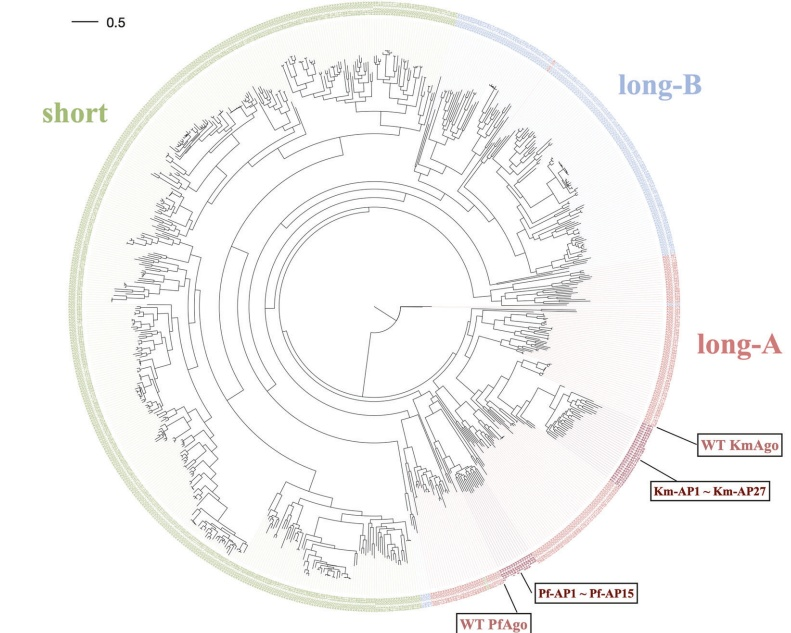

b

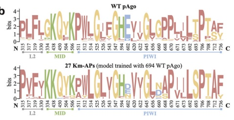

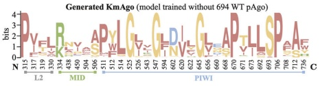

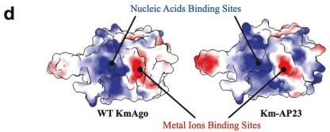

d

将转角折叠为β-折叠（在补充图S66中以绿色高亮显示）。该观察结果表明，与野生型相比，存在更多的氢键和盐桥（补充表S18）。总体而言，催化位点周围相互作用的增加可能增强催化口袋的结构稳定性。

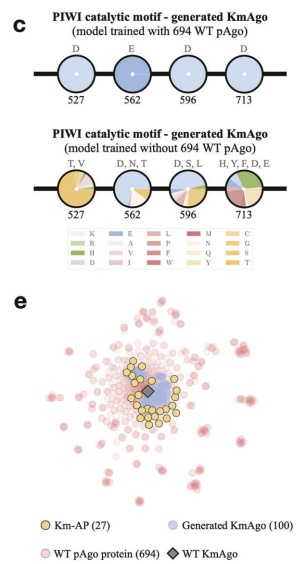

e

我们进一步使用分子动力学模拟计算了gDNA/tDNA在Km-WT、Km-AP23（功能增强型）和Km-AP9（功能减弱型）催化口袋中的结合自由能（蛋白质–gDNA–tDNA复合物的结构由AlphaFold3生成）。如补充图S67所示，gDNA/tDNA在Km-催化口袋中的结合自由能

---

**图 5** CPDiffusion 生成的 pAgo 蛋白的进化分析。a 天然 pAgo 蛋白序列与生成的 Km-APs 及 Pf-APs 的系统发育树。b 野生型（WT）pAgo（上栏）、Km-APs（中栏）以及使用不含 pAgo 数据集训练的 CPDiffusion 生成的 KmAgo 序列（下栏）的保守模式。保守位置根据 pAgo 数据集的比对结果呈现。c Km-APs（上栏）与使用不含 pAgo 数据集训练的 CPDiffusion 生成的 KmAgo 序列（下栏，详见补充图 S100）催化基序（DEDD）处的氨基酸组成。每个饼图表示生成蛋白序列在饼图下方指定位置上的氨基酸组成，饼图上方列出出现频率 > 5% 的主要氨基酸类型。使用 pAgo 数据集训练显著提升了模型在保持 KmAgo 保守模式方面的性能。d Km-WT 与 Km-AP23 中 MlD 结构域和 PIWI 结构域的静电表面。颜色范围从红色（负电位）经白色过渡到蓝色（正电位）。箭头指示核酸结合位点和金属离子结合位点。e 使用 t-分布随机邻域嵌入（t-SNE）对 WT pAgo 与生成的 KmAgo 进行计算分析。每个点代表一个蛋白序列在二维空间中的嵌入，用于可视化目的。CPDiffusion 生成的 Km-APs 倾向于从 Km-WT 向整个 WT pAgo 蛋白景观移动。

Km-AP23 中的值低于 Km-WT，而 Km-AP9 中的值则更高。这表明，与 Km-WT 相比，Km-AP23 的催化口袋中 gDNA/tDNA 的结合亲和力更高，而 Km-AP9 则较低。这种稳定的结合状态可能有利于 tDNA 的切割，因为催化口袋的构象对于催化基序切割 tDNA 至关重要 $ ^{38,45} $。

## 讨论

本研究介绍了 CPDiffusion，这是一种新颖的流程，用于生成针对给定蛋白骨架定制的功能序列。我们通过将其应用于基于野生型 KmAgo 和 PfAgo 生成具有增强功能的中温核酸内切酶，展示了这一生成流程的巨大潜力。生成的 KmAgo 和 PfAgo 新序列与其野生型模板序列的相似度低于 70%。对于这两组设计的 pAgo 蛋白，超过 90% 的新序列获得了 DNA 切割活性，其中 70% 以上的活性相较于野生型基线有所增强。值得注意的是，性能最佳的新型 KmAgo 活性比野生型 KmAgo 高出九倍。最佳的新型 PfAgo 将野生型 PfAgo 的熔解温度从约 100 °C 降至 50 °C，并且在 45 °C 下的 ssDNA 切割活性是野生型 PfAgo 在 95 °C 下的两倍，后者在中等温度下是野生型 KmAgo 的 11 倍。这些显著结果证明了 CPDiffusion 在自动从野生型功能蛋白学习并设计具有高度复杂生物功能的有效蛋白序列以增强功能方面的强大潜力。

此外，具有增强功能的 APs 有望应用于体内生物技术 $ ^{25} $，特别是细胞水平的核酸标记。它们的高底物亲和力、在蛋白-底物复合物中的稳定性以及精确靶向能力，相较于传统核酸结合方法（如 DNA-painting 和荧光原位杂交（FISH）$ ^{27,46} $）具有显著优势。例如，APs 可以协助 gDNA 与哺乳动物细胞（如 HEK293T 细胞、HeLa 细胞和果蝇胚胎）内的核酸结合。gDNA 携带突出端引发序列，以启动杂交链式反应，从而招募多个荧光标记的二级探针并组装成链以放大信号。与传统 FISH 相比，基于 pAgo 的 FISH 可以在中等温度下有效且精确地对细胞内的核酸进行染色，无需使用甲酰胺处理——甲酰胺已知具有毒性且是潜在致畸物。此外，APs 的高切割活性可用于在细胞中特异性切割标记的核酸，为多轮核酸标记铺平道路。而且，具有增强功能的 pAgo 与核酸酶缺陷的 RecBC 解旋酶的联合作用，具有切割双链 DNA 的潜力 $ ^{29} $，可能催生精确靶向致病基因的基因治疗方法。因此，APs 的应用可为开发疗法、体内成像、癌症免疫治疗和基因编辑带来新的机遇。

近年来，在利用深度学习方法设计新功能蛋白并进行实验验证方面取得了显著进展。ProteinGAN $ ^{6} $ 直接从氨基酸序列的复杂多维空间中学习蛋白序列的进化关系。在 ProteinGAN 生成的 55 条包含 321 个氨基酸和一个功能域的人工序列中，24% 的新蛋白具有可溶性并表现出苹果酸脱氢酶催化活性。预训练的 ProGen $ ^{8} $ 是一个在 2.8 亿条蛋白序列和数十亿网络参数上训练的大型语言模型，能够实现条件蛋白设计。通过针对特定蛋白家族微调模型，它生成了序列同一性较低的溶菌酶序列（约 120 个氨基酸），其中数千个蛋白样本显示出活性。最近，Watson 等人 $ ^{9} $ 提出了 RFdiffusion，一种基于结构的功能导向蛋白设计方法。该方法在蛋白单体设计、蛋白结合剂设计、对称寡聚体设计、酶活性位点支架设计以及对称基序支架设计方面表现出色。相比之下，CPDiffusion 建立了一个离散去噪扩散模型，用于生成以蛋白特定条件（如模板二级和三级结构、以及高度保守的氨基酸）为特征的蛋白序列。利用这些对所研究蛋白的规范描述，CPDiffusion 可在 400 万个参数（在约 20,000 个家族多样性和 700 个家族特异性野生型蛋白上训练）下自动生成有效序列。该模型理解蛋白内在的序列-结构-功能构建规则，从而指导序列生成，即使是对于过长的蛋白序列（约 800 个氨基酸）和具有高度复杂功能（六个功能域）的序列也是如此。CPDiffusion 从训练的 pAgo 蛋白家族中有效学习了保守模式和其他构建规则。值得注意的是，CPDiffusion 生成的 pAgo 序列从模板野生型蛋白向 pAgo 蛋白家族的景观分散，涵盖了多样的氨基酸组合和酶学机制。尽管序列差异显著，CPDiffusion 生成的蛋白在高维空间中与天然蛋白展现出高度相似性。换句话说，我们的方法掌握了自然界中蛋白序列、结构和功能的知识，促进了潜在空间中的探索，以揭示具有所需性质（如热稳定性、对底物的亲和力（ $ K_{M} $）、催化效率（ $ k_{cat} $）以及总体活性（ $ k_{cat}/K_{M} $））的新型蛋白序列。与理性设计或定向进化相比，我们的基于深度学习的蛋白生成策略促进了探索蛋白序列的更广阔领域，同时保持了功能完整性。此外，由于我们的方法在生成具有酶活性的多样化蛋白序列（单次改变多达 400 个氨基酸）方面表现出高成功率（>90%），它为蛋白质工程及序列库和蛋白适应性景观的潜在扩展提供了新途径，为研究人员在家族范围内探索所需蛋白功能提供了更广泛的选择范围。

---

CPDiffusion致力于生成与野生型（WT）蛋白质序列同源性低、但酶学活性显著提升从而更契合特定应用需求的新型氨基酸序列。野生型蛋白质在迥异的生理条件下历经数亿年自然进化，虽能以差异巨大的序列展现相似的酶学功能，但人工模拟这一进化过程时失败概率极高。CPDiffusion从少量训练数据集中学习，可一步实现对数百个氨基酸位点的改造，进而设计全新多结构域序列。值得注意的是，CPDiffusion的成功率超过90%，并成功发现了文献中未曾报道的高活性序列。其底层生成策略在拓展潜在候选蛋白质库方面也发挥着关键作用，从而为现有蛋白质的探索建立了范式转变。此外，我们的端到端生成方法促进了蛋白质工程工作。当将蛋白质工程化至期望功能时，本方法无需像定向进化方法那样进行耗时的迭代筛选——后者从单点突变出发，通过冗长的迭代过程逐步组合多种突变。同时，CPDiffusion中集成的逐步去噪步骤可被视为从任意初始序列通向其在潜在空间中优化状态的引导路径。本模型通过一步直接生成具备优良生物学性能的蛋白质，简化了生成与进化过程。进而，这一方法提供了大量新颖的起始点，推动定向进化快速发现具有优异特性的新序列。CPDiffusion所展现的高效性与有效性预示着其在加速蛋白质设计与发现方面的广阔前景。

##### 材料与方法

#### 条件性蛋白质去噪扩散

DDPMs$^{11}$通过参数化离散时间正向扩散过程的逆过程来近似分布。在蛋白质序列生成场景中，正向扩散作用于氨基酸类型分布$X_{a}^{a}$，涉及T步迭代噪声添加，直至达到$q(X_{T}^{a})$——一个与参考独立转移分布不可区分的分布。正向扩散$(X_{0}^{a} \rightarrow X_{T}^{a})$利用定义的正向扩散核$q(X_{t}^{a}, X_{t-1}^{a}) = X_{t-1}^{a} / Q_{t}$，在每一步$t = 1, \ldots, T$采样$X_{a}^{a}$，直至$X_{t}^{a} \sim q(X_{t}^{a})$，其中$Q_{t}$表示t时刻的转移概率。逆向扩散$(X_{T}^{a} \rightarrow X_{0}^{a})$采样$X_{a}^{a} \sim p_{\theta}(X_{t}^{a}) \approx q(X_{0}^{a})$，从而从先验分布转换为学习到的数据分布的样本，即$X_{0}^{a} \approx p_{\theta}(X_{0}^{a})$。在渐进训练过程中，生成概率分布$p_{\theta}(X_{t-1}^{a} | X_{t}^{a})$由神经网络$f(\theta)$参数化，该网络嵌入了蛋白质实例的额外表征，如拓扑结构和物理化学特征。我们将蛋白质表示为以氨基酸为节点的图，并实现等变图神经网络（例如EGNN$^{47}$），该网络在基于相邻氨基酸的相对空间关系聚合节点属性时具有旋转和平移等变性。还可插入其他条件来引导去噪过程，如二级结构和转移矩阵。值得注意的是，我们将保守氨基酸定义为已知区域，并对无条件的DDPM进行逆向扩散过程条件化，以实现序列修复$^{14}$。我们固定了WT KmAgo$^{32,43}$中的D713位点，该位点是催化位点的位置，取决于具体的Ago蛋白。神经网络$f(\theta)$中的权重通过最小化$\hat{p}_{\theta}(X^{a})$（近似$p_{\theta}(X^{a})$的网络预测）与观测到的氨基酸类型之间的交叉熵$\mathcal{L}_{CE}$来优化。扩散模型的更多细节见补充信息。

##### 结构预测与比较

为了预测经条件性蛋白质去噪扩散生成的人工Ago序列的结构，我们使用AlphaFold2的单序列模式，结合MSA和PDB模板。使用五个模型中排名最高的预测结构。本研究中WT与人工Ago蛋白之间的RMSD值通过PyMOL（The PyMOL Molecular Graphics System, Version 2.0, Schrödinger, LLC.）计算。氢键定义为蛋白质中的极性接触；盐桥通过识别氨基酸中的氧原子与碱性氨基酸对中距离在4 Å以内的氮原子来表征。

##### pAgo蛋白质数据库

我们构建了一个包含694个pAgo蛋白的数据集，选自一个综合性的Ago数据集$^{37}$。该精选集合代表了pAgo类型的广泛多样性，包括短型、长A型和长B型pAgo蛋白。我们使用AlphaFold2$^{59}$提供的全部五个模型来预测WT pAgo序列的结构。由于五个模型的结果总体一致，我们使用所有蛋白质通过模型1的结果进行后续分析。在补充图S100和S101中，我们深入探讨了pAgo数据库的多样性，以缓解对数据偏差的担忧，并强调了其在提升CPDiffusion性能中的关键作用。总体而言，数据集中的pAgo蛋白在序列多样性的同时表现出结构保守性。此外，大多数WT蛋白为嗜温性pAgo，少数长A型pAgo属于嗜热类别。

#### 序列与结构分析

将模型生成的Ago蛋白与数据库中的694个Ago蛋白进行多序列比对（MSA），使用MUSCLE v5软件的super5算法$^{48}$。每个残基的保守性评分按下式计算：

$$ R_{seq}=\log_{2}N-\left(-\sum_{n=1}^{N}p_{n}\log_{2}p_{n}\right), $$

其中$p_n$是氨基酸n的观测频率，$N = 20$代表全部20种氨基酸。保守性得分等于$R_{\text{seq}}$乘以该列中非空位位置的比例，以施加空位罚分。选择Ago数据库中得分高于2.5的残基。排除设计中得分低于0.2的残基，以减轻比对差异（补充图S99）。使用WebLogo$^{49}$可视化保守残基。使用IQ-TREE v1.6计算系统发育树，采用1500次超快自展，并以BLOSUM62作为替代模型$^{50}$。使用FigTree v1.4.4（http://tree.bio.ed.ac.uk/software/figtree/）可视化系统发育树。随后使用Chimera可视化工具中的 'coulombic' 命令评估蛋白质的静电表面，即库仑静电势，该命令以图形方式展示蛋白质表面的静电势分布。

#### 在BL21(DE3)中的蛋白质表达与纯化

由上海生工生物科技有限公司（中国上海）合成了KmAgo、Km-APs、PfAgo、Pf-APs、BlAgo、PbAgo、CbAgo和SeAgo基因的密码子优化版本。将这些基因克隆至pET15(b)质粒（Ago蛋白的构建见补充图S48和S49）中，构建携带N端His标签的pEX-Ago。将表达质粒转化至大肠杆菌BL21(DE3)细胞中。在含有50 μg/mL卡那霉素的LB培养基中于37 °C培养30 mL种子培养物，随后转移至含50 μg/mL卡那霉素的500 mL LB摇瓶中。培养基于37 °C培养至OD600达到0.6–0.8，然后加入异丙基-β-D-硫代半乳糖苷（IPTG）至终浓度0.5 mM诱导蛋白质表达，随后在18 °C下培养16–20小时。通过4000 rpm离心30分钟收集细胞，收集细胞沉淀用于后续纯化。将细胞沉淀重悬于裂解缓冲液（25 mM Tris-HCl，500 mM NaCl，10 mM咪唑，pH 7.4）中，然后使用高压均质机在700–800 bar下破碎5分钟（Gefran，意大利）。裂解液于4 °C、12,000 rpm离心30分钟，取上清进行Ni-NTA亲和纯化，使用洗脱缓冲液（25 mM Tris-HCl，500 mM NaCl，250 mM咪唑，pH 7.4）。随后使用Superdex 200（GE Tech，美国）进行凝胶过滤纯化，洗脱缓冲液相同。通过SDS-PAGE分析凝胶过滤得到的组分。将含蛋白质的组分在缓冲液（15 mM Tris-HCl，pH 7.4，200 mM NaCl，10%甘油）中于−80 °C速冻。

---

##### ssDNA/RNA 切割实验

对 WT 和 APs 的标准活性测定中，切割实验以 2:1:1、5:2:2 或 3:2:2 的摩尔比（蛋白质:引导链:靶标链）进行。为研究温度对蛋白质活性的影响，在 ssDNA 切割实验前，将蛋白质在 42 °C 下分别孵育 2 分钟和 5 分钟。首先，将 5 μM 蛋白质与合成的 1 μM gDNA 引导链在反应缓冲液（15 mM Tris-HCl (pH 7.4)、200 mM NaCl 和 5 mM MnCl₂）中混合。然后将溶液在 37 °C 下预孵育 20 分钟。预孵育后，加入 1 μM tDNA，其 5' 端标记有荧光基团 6-FAM，3' 端标记有淬灭基团 BHQ1。使用实时荧光定量 PCR 系统 QuantStudio 5 (Thermo Fisher Scientific, 美国) 追踪荧光信号，激发波长 λₘₐₓ = 495 nm，发射波长 λₘₐₓ = 520 nm。结果由 QuantStudio™ Design & Analysis Software v1.5.1 分析。切割所用的引导链和靶标核酸列于补充表 S16 和 S17。为测定 Ago 蛋白的切割活性，进行了两次独立实验。原始数据见补充图 S55–S59 和 S92。对于动力学测定，通过将米氏方程拟合至各反应速度对 ssDNA 靶标浓度的函数，确定了参数 k_cat 和 k_m。

##### 圆二色光谱

Km-WT 和 Km-APs 二级结构的 CD 测量在 Jasco J-1500 圆二色光谱仪上进行，使用 1 mm 光程比色皿。蛋白质浓度为 0.1 mg/mL，溶于 1× PBS 缓冲液 (pH = 7.4)。对于 CD 光谱，使用 PBS 缓冲液代替 Tris-HCl 缓冲液作为溶剂，因为 Tris-HCl 缓冲液具有强 CD 背景，会显著影响蛋白质 CD 信号的分析 $ ^{44} $。原始数据见补充图 S51。

##### 荧光偏振分析

为测定蛋白质与 gDNA 或 tDNA 结合的表观 $ K_d $，使用多功能酶联免疫吸附测定酶标仪 (Spark, Tecan) 进行了荧光偏振分析。溶液制备方法如下：在反应缓冲液（15 mM Tris-HCl, pH 7.4, 200 mM NaCl 和 5 mM MnCl $ _2 $）中，将 5 nM 3' 端 6-FAM 标记的 gDNA 或 tDNA 与浓度范围为 0 至 1500 nM 的蛋白质混合。将该混合物在 37 °C 下孵育 1 小时，随后转移至避光的 96 孔 ELISA 板。偏振程度使用 Spark Tecan 酶标仪测定，激发波长为 485 nm，发射波长为 525 nm。所有实验均独立进行三次。结合百分比使用 Microsoft Excel 和 Prism 8 (GraphPad) 软件分析。数据使用 Hill 方程拟合，Hill 系数设为 2 至 2.5。原始数据见补充图 S54。

##### 无细胞蛋白表达与提取

Km-WT 和 Km-APs 的表达利用 Tierra Bioscience 无细胞表达平台完成。无细胞提取物的制备用于蛋白表达，遵循 Sun 等人 $ ^{51} $ 建立的方法。

#### 差示扫描荧光分析

每种蛋白质样品（PfAgo 和 Pf-APs）含 1 μM 蛋白质，溶于含 15 mM Tris-HCl (pH = 7.4) 和 200 mM NaCl 的缓冲液，每个样品制备三次并加入 PCR 管。在蛋白质测量前，向管中加入适量 5000× 储备液 (Sigma-Aldrich) 的 SYPRO Orange 染料，使染料终浓度为 5×。使用 Q-PCR (Analytikjena, 德国) 在 470 nm 激发 SYPRO Orange 染料，监测其在 570 nm 的荧光发射，以此监测蛋白质的热变性。基线校正使用 PCR 仪器上的 Opticon Monitor 软件。原始数据见补充图 S95。

##### SAXS

采用 SAXS 测量分析蛋白质在缓冲液中的状态。同步辐射 SAXS 测量在上海同步辐射光源 BL19U2 线站进行。X 射线波长为 0.103 nm。蛋白质样品溶于含 15 mM Tris-HCl (pH 7.4) 和 200 mM NaCl 的缓冲液中。样品浓度为 0.5 mg/mL。蛋白质溶液装入硅片池中，随后通过注射泵缓慢更新液体以防止 X 射线损伤。为计算蛋白质的绝对强度，还在 37 °C 下测量了空池和缓冲液。二维 (2D) 衍射图样由 Pilatus 2 M 探测器收集，分辨率为 1043 × 981 像素，像素大小为 172 μm × 172 μm。连续采集 20 帧二维图像，每帧曝光时间 0.5 秒。然后使用欧洲同步辐射光源的 Fit2D 软件将二维散射图样积分为一维 (1D) 强度曲线。无辐射损伤的帧用于后续处理。一维数据使用 ScAtter 和 ATSAS 软件处理。

#### MD 模拟

模拟所用蛋白质与核酸的结构由 AlphaFold3 预测。蛋白质和大量水分子填充于立方盒子中。加入 16 个氯离子以保持体系电荷中性。采用 CHARMM36m 力场描述复合物，选择 CHARMM 修正的 TIP3P 模型描述水分子。模拟在 310 K 下进行。经过 4000 步能量最小化后，体系在 NVT 系综下加热并平衡 100 ps，在 NPT 系综下平衡 500 ps。在 1 atm 下进行 100 ns 生产模拟，采用合适的周期性边界条件，积分步长设为 2 fs。含氢原子的共价键通过 LINCS 算法约束。Lennard-Jones 相互作用的截断半径为 12 Å，并在 10 Å 至 12 Å 范围内使用力切换函数。静电相互作用使用粒子网格 Ewald 方法计算，截断半径为 12 Å，网格间距约 1 Å，四阶样条插值。系统温度和压力分别由速度重新标度恒温器和 Parrinello-Rahman 算法控制。所有 MD 模拟均使用 GROMACS 2020.4 软件包进行。

##### EMSA

为检测 gDNA 加载到蛋白质上的情况，将蛋白质与 3' 端 FAM 标记的引导链在 20 μL 反应缓冲液（含 15 mM Tris-HCl (pH 7.4)、200 mM NaCl）中孵育 20 分钟。3' 端 FAM 标记的引导链和蛋白质浓度分别固定为 1 μM 和 2 μM。然后将样品与 5 μL 5× 上样缓冲液 (Tris-HCl (pH 7.4)、25% 甘油、溴酚蓝) 混合，并通过 12% 非变性 PAGE 分离。核酸使用 Gel Doc™ XR+ 可视化。

#### 致谢

作者感谢上海交通大学高性能计算中心提供计算资源。本工作受国家自然科学基金（11974239; 62302291）、上海市教育委员会创新计划（2019-01-07-00-02-E00076）、上海交通大学科技创新基金（21X010200843）、上海交通大学学生创新中心以及上海人工智能实验室资助。L.Z. 感谢上海同步辐射光源 BL19U2 线站的李娜博士在同步辐射 X 射线测量（课题编号 h20pr0008）中提供的帮助。

#### 作者贡献

B. Zhou 和 L.Z. 提出概念、设计实验并撰写原稿。B. Zhou、K.Y. 和 Y.T. 开发了 CPDiffusion。L.Z.、B.W. 和 Q.L. 进行了湿实验。L.Z. 进行了 MD 模拟和结构分析。B. Zhong 进行了生物信息学分析。B. Zhou、L.Z.、P.L. 和 L.H. 修改了手稿。

#### 数据可用性

所有数据均呈现于正文和补充信息中。

#### 代码可用性

模型实现可在 https://github.com/bzho3923/CPDiffusion 获取。

#### 利益冲突

B. Zhou、L.Z.、B.W. 和 L.H. 是与所述工作相关的临时专利申请的发明人。其他作者声明无竞争性利益。

---

##### 补充信息

有关材料请求和通信事宜，请分别联系郑立荣、Pietro Liò 或洪亮。

出版商声明：Springer Nature 对于已出版地图中的管辖权主张及机构隶属关系保持中立。

## 参考文献

1. Huang, P.-S., Boyken, S. E. & Baker, D. The coming of age of de novo protein design. Nature 537, 320–327 (2016).

2. Pearce, R. & Zhang, Y. Deep learning techniques have significantly impacted protein structure prediction and protein design. Curr. Opin. Struct. Biol. 68, 194–207 (2021).

3. Lu, H. et al. Machine learning-aided engineering of hydrolases for PET depolymerization. Nature 604, 662–667 (2022).

4. Thean, D. G. et al. Machine learning-coupled combinatorial mutagenesis enables resource-efficient engineering of CRISPR-Cas9 genome editor activities. Nat. Commun. 13, 1–14 (2022).

5. Tan, Y., Zhou, B., Zheng, L., Fan, G. & Hong, L. Semantical and geometrical protein encoding toward enhanced bioactivity and thermostability. Elife 13, RP98033 (2024).

6. Repecka, D. et al. Expanding functional protein sequence spaces using generative adversarial networks. Nat. Mach. Intell. 3, 324–333 (2021).

7. Dauparas, J. et al. Robust deep learning-based protein sequence design using proteinmpnn. Science 378, 49–56 (2022).

8. Madani, A. et al. Large language models generate functional protein sequences across diverse families. Nat. Biotechnol. 41, 1099–1106 (2023).

9. Watson, J. L. et al. De novo design of protein structure and function with rdf-fusion. Nature 620, 1089–1100 (2023).

10. Sohl-Dickstein, J., Weiss, E., Maheswaranathan, N. & Ganguli, S. Deep unsupervised learning using nonequilibrium thermodynamics. In International Conference on Machine Learning, 2256–2265 (PMLR, 2015).

Ho, J., Jain, A. & Abbeel, P. Denoising diffusion probabilistic models. Adv. Neural Inf. Process. Syst. 33, 6840–6851 (2020).

esh, A. et al. Zero-shot text-to-image generation. In International Conference Machine Learning, 8821–8831 (PMLR, 2021).

13. Ho, J. et al. Video diffusion models. Advances in Neural Information Processing Systems 35, 8633–8646 (2022).

14. Lugmayr, A. et al. Repaint: inpainting using denoising diffusion probabilistic models. In Proceedings of the IEEE/CVF Conference on Computer Vision and Pattern Recognition, 11461–11471 (2022).

15. Yi, K., Zhou, B., Shen, Y., Lio, P. & Wang, Y. G. Graph denoising diffusion for inverse protein folding. In Thirty-seventh Conference on Neural Information Processing Systems (2023).

16. Corso, G., Stärk, H., Jing, B., Barzilay, R. & Jaakkola, T. S. Diffdock: diffusion steps, twists, and turns for molecular docking. In The Eleventh International Conference on Learning Representations (2023).

17. Vignac, C. et al. Digress: Discrete denoising diffusion for graph generation. In The Eleventh International Conference on Learning Representations (2023).

18. Hoogeboom, E., Satorras, V. G., Vignac, C. & Welling, M. Equivariant diffusion for molecule generation in 3D. In International Conference on Machine Learning, 8867–8887 (PMLR, 2022).

19. Gruver, N. et al. Protein design with guided discrete diffusion. Adv. Neural Inf. Process. Syst. 36 (2024).

20. Hegge, J. W., Swarts, D. C. & van der Oost, J. Prokaryotic argonaute proteins: novel genome-editing tools? Nat. Rev. Microbiol. 16, 5–11 (2018).

21. Song, J. et al. Highly specific enrichment of rare nucleic acid fractions using thermus thermophilus argonaute with applications in cancer diagnostics. Nucleic Acids Res. 48, e19 (2020).

22. Liu, Q. et al. Argonaute integrated single-tube PCR system enables supersensitive detection of rare mutations. Nucleic Acids Res. 49, e75 (2021).

23. Wang, F. et al. Pfago-based detection of sars-cov-2. Biosens. Bioelectron. 177, 112932 (2021).

24. Xun, G. et al. Argonaute with stepwise endonuclease activity promotes specific and multiplex nucleic acid detection. Bioresour. Bioprocess. 8, 1–12 (2021).

25. Graver, B. A., Chakravarty, N. & Solomon, K. V. Prokaryotic argonautes for in vivo biotechnology and molecular diagnostics. Trends Biotechnol. 42, 61–73 (2024).

26. Filius, M. et al. High-speed super-resolution imaging using protein-assisted dna-paint. Nano Lett. 20, 2264–2270 (2020).

27. Chang, L. et al. Agofish: cost-effective in situ labelling of genomic loci based on dna-guided dttago protein. Nanoscale Horiz. 4, 918–923 (2019).

28. Toudji-Zouaz, A., Bertrand, V. & BarriSre, A. Imaging of native transcription and transcriptional dynamics in vivo using a tagged argonaute protein. Nucleic Acids Res. 49, e86 (2021).

29. Vaiskunaite, R., Vainauskas, J., Morris, J. J., Potapov, V. & Bitinaite, J. Programmable cleavage of linear double-stranded dna by combined action of argonaute cbago from clostridium butyricum and nuclease deficient recbc helicase from E. coli. Nucleic Acids Res. 50, 4616–4629 (2022).

30. Li, X. et al. Mesophilic argonaute-based isothermal detection of sars-cov-2. Front. Microbiol. 13, 957977 (2022).

31. Qin, Y., Li, Y. & Hu, Y. Emerging argonaute-based nucleic acid biosensors. Trends Biotechnol. 40, 910–914 (2022).

32. Kropocheva, E., Kuzmenko, A., Aravin, A. A., Esyunina, D. & Kulbachinskiy, A. A programmable pago nuclease with universal guide and target specificity from the mesophilic bacterium kurthia massiliensis. Nucleic Acids Res. 49, 4054–4065 (2021).

33. Swarts, D. C. et al. Argonaute of the archaeon pyrococcus furiosus is a dna-guided nuclease that targets cognate dna. Nucleic Acids Res. 43, 5120–5129 (2015).

34. Li, Y. et al. Comparison of crispr/cas and argonaute for nucleic acid tests. Trends Biotechnol. 41, 595–599 (2023).

35. Orengo, C. et al. CATH – a hierarchic classification of protein domain structures. Structure 5, 1093–1109 (1997).

36. Ingraham, J., Garg, V., Barzilay, R. & Jaakkola, T. Generative models for graph-based protein design. Adv. Neural Inf. Process. Syst. 32 (2019).

37. Ryazansky, S., Kulbachinskiy, A. & Aravin, A. A. The expanded universe of prokaryotic argonaute proteins. MBio 9, 10–1128 (2018).

38. Sheng, G. et al. Structure-based cleavage mechanism of thermus thermophilus argonaute dna guide strand-mediated dna target cleavage. Proc. Natl. Acad. Sci. USA 111, 652–657 (2014).

39. Jumper, J. et al. Highly accurate protein structure prediction with AlphaFold. Nature 596, 583–589 (2021).

40. Hegge, J. W. et al. Dna-guided DNA cleavage at moderate temperatures by clostridium butyricum argonaute. Nucleic Acids Res. 47, 5809–5821 (2019).

41. Rivas, F. V. et al. Purified argonaute2 and an sirna form recombinant human risc. Nat. Struct. Mol. Biol. 12, 340–349 (2005).

42. Wheeler, D. L. et al. Database resources of the national center for biotechnology information. Nucleic Acids Res. 36, D13–D21 (2007).

43. Liu, Y. et al. A programmable omnipotent argonaute nuclease from mesophilic bacteria kurthia massiliensis. Nucleic Acids Res. 49, 1597–1608 (2021).

44. Zheng, L. et al. Loosely-packed dynamical structures with partially-melted surface being the key for thermophilic argonaute proteins achieving high dna-cleavage activity. Nucleic Acids Res. 50, 7529–7544 (2022).

45. Lisitskaya, L., Aravin, A. A. & Kulbachinskiy, A. DNA interference and beyond: structure and functions of prokaryotic argonaute proteins. Nat. Commun. 9, 5165 (2018).

46. Shin, S. et al. Quantification of purified endogenous mirnas with high sensitivity and specificity. Nat. Commun. 11, 6033 (2020).

47. Satorras, V. G., Hoogeboom, E. & Welling, M. E(n) equivariant graph neural networks. In International Conference On Machine Learning, 9323–9332 (2021).

48. Edgar, R. C. Muscle: multiple sequence alignment with high accuracy and high throughput. Nucleic Acids Res. 32, 1792–1797 (2004).

49. Crooks, G. E., Hon, G., Chandonia, J.-M. & Brenner, S. E. Weblogo: a sequence logo generator. Genome Res. 14, 1188–1190 (2004).

50. Minh, B. Q. et al. lq-tree 2: new models and efficient methods for phylogenetic inference in the genomic era. Mol. Biol. Evol. 37, 1530–1534 (2020).

51. Sun, Z. Z. et al. Protocols for implementing an Escherichia coli based TX-TL cell-free expression system for synthetic biology. J. Vis. Exp. 79, e50762 (2013).

52. Zheng, L. et al. Mn 2+-induced structural flexibility enhances the entire catalytic cycle and the cleavage of mismatches in prokaryotic argonaute proteins. Chem. Sci. 15, 5612–5626 (2024).

**开放获取** 本文采用知识共享署名 4.0 国际许可协议（Creative Commons Attribution 4.0 International License）进行许可，该协议允许在任何媒介或格式中复制、共享、改编、分发和复制作品，前提是您适当注明原始作者和来源，提供指向知识共享许可协议的链接，并注明是否进行了修改。本文中的图像或其他第三方材料均包含在文章的知识共享许可协议中，除非在材料的署名行中另有说明。如果材料未包含在文章的知识共享许可协议中，且您的预期使用不被法律法规允许或超出许可范围，则您需要直接获得版权持有人的许可。如需查看该许可协议的副本，请访问 http://creativecommons.org/licenses/by/4.0/。

© 作者（们）2024